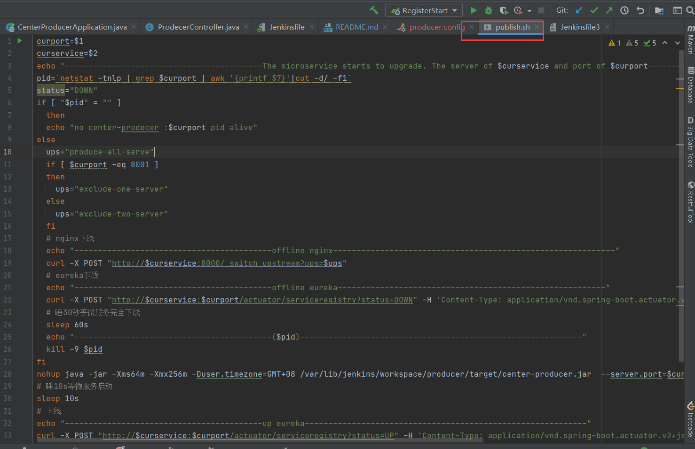

## 第一版本ci/cd
```
center
├─center-consumer      消费者（主要用来测试eureka流量）
│ 
├─center-registry      eureka注册中心
│       
├─center-producer      生产者（接口测试）
│       


```

环境：CentOS7 + OpenResty（Nginx）+ gitlab + jenkins + eureka + maven

说明：由于我这个项目没有网关服务，所以需要对Nginx进行动态负载均衡。如果集成了网关服务，在自动化部署当中Nginx是不必要的，只需要操作eureka进行上线下线就可以了。（主要看center-producer微服务，主要看center-producer微服务，主要看center-producer微服务）

步骤：1.在OpenResty安装目录下的Nginx新建一个config文件，在nginx.conf配置文件中末尾加上include config/*.config;用来加载刚刚新建文件夹下的配置文件。
在新建config文件夹下添加producer.config文件。(config文件我放在项目md文件夹同一目录下面了)
     2.jenkins配置好jdk，maven。新建一个job。

jenkins自动化job的编写有俩种。一种是shell配置，一种是pipeline。
我先说下我shell方式的jenkins配置吧,第一个是全自动化的,事先把所需要的参数都直接在shell里面(直接上图):（ps：如果实在不想点build now，可以搞一个web hook）
源码配置：


build配置：


shell编写：


第二个是半自动化的参数化构建(就是先一台机器升级，人为确认无误之后再升级另外的机器):
其中，commit是github提交hash值。也可以基于标签的形式进行发布


参数配置：


源码配置：


build配置：


shell脚本：


pipeline自动化部署（也是直接上图吧）：
这里可以点发布和回滚俩种操作：


参数配置：(这里面注意有默认值，设置了默认值之后，我可以在正式服务器当中通过web hook进行自动化部署)


触发器webhook设置：


流水线配置：我是通过scm，在项目当中写jenkinsfile部署的。


我把部署shell脚本放在一个publish.sh文件里面(在center-producer下)：


jenkinsfile配置：(文件放在center-producer下，直接看文件吧！jenkinsfile3是我的初始版本，只有发布，没有回滚)


## 2022-1-24第二版本：基于harbor + jenkins + gitlab + k8s的ci\cd
```
center
├─center-consumer      消费者（主要用来测试eureka流量）
│ 
├─center-registry      eureka注册中心
│       
├─center-producer      生产者（接口测试）
│       
├─center-gateway       网关（提供统一入口）
|
├─template             模板存放

```

环境：
+ 腾讯云轻量级服务器4台（双十一含泪花了1200大洋）:2台2核4G+1台4核8G+朋友dark1台2核4G
+ k8s、gitlab、jenkins、nacos、maven、spring-cloud、harbor、spring-boot

背景介绍:这一版是我和舍友两个人一起搞出来的,由于在前段时间粗略看了《kubernetes权威指南第五版》，对kubernetes有了一定的了解。所以第二版主要目的不仅仅是搞出ci/cd,主要还是学习k8s学习、深入和实践;思考实践k8s在jenkins-pipeline的应用;对以前ci/cd的一个“抽象”。

项目流程结构图:

一个web请求所经历的流程:

遇到的困难:
* k8s的搭建
* k8s问题的排查
* flannel中k8s pod及容器无法跨主机互通问题
* kubesphere搭建问题
* kubesphere组件问题
* NFS做PVC问题
* Ingress问题
* jenkinsFile模板和微服务分离问题
* nacos问题
* loki日志系统的配置

一些思考: 
* eureka和nacos的选择:我选择nacos,因为nacos不仅是注册中心,还能作为配置中心使用。而且nacos既可以AP，也可以是CP。相比eureka的AP理论nacos有更多选择的可能性.而且nacos还能通过namespace来切分不同的环境。
* 就绪指针和存活指针:在微服务当中依赖spring boot actuator暴露health api作为pod指针的选择
* k8s-service的思考:之前一直搞不明白在我看别人开源项目k8s部署的时候为什么一个service对应一个微服务。直到后面我把好几个微服务混在一个service里面才明白，当多个微服务在同一个service的时候，service分辨不出哪个端口由哪些pod管理(比如一个service有nacos和consumer两个微服务pod，当我们访问nacos的时候，可能访问到consumer所在的pod里面，导致报错)。
* ingress和nginx的选择:我选择ingress,一是因为nginx我是比较熟悉了,而ingress比较陌生。二是因为ingress是k8s的一个组成,天然契合k8s。三是因为ingress可以通过service-name去匹配。eg:在ingress使用的时候，需要一个ingress-controller。我使用的是nginx-ingress-controller，后面发现controller其实就是对nginx的一个封装。
* efk和loki的选择:最开始我是想选efk作为这个项目的日志收集系统，但是由于es太耗费内存了。只能另寻它法,然后在ks开源群里有个老哥提了一下loki日志系统,经过了解一番后果断选择Loki。因为loki占磁盘少,不需要耗内存。对服务器资源影响很小。
* 使用maven插件打版本tag
* jenkins模板和项目分离:我一开始以为git parameter插件可以通过《已选仓库》参数来获取gitlab的项目tag,后来发现不行，查找资料发现这个参数只是一个正则匹配参数。我是依赖Active Choices插件然后编写groovy脚本通过gitlab api获取到项目的tag。这样的话pipeline整个项目全部微服务就都可以使用同一个jenkinsFile模板。然后我通过hidden parameter插件把除了tag的其它的参数全部隐藏掉了。这样的话当有新微服务上来的时候,只需要复制一个其它项目,修改微服务名和gitlab项目微服务id就能完成复制
* 引入gateway是因为在我们发布新版本的时候，不需要频繁的对nginx进行操作，作为外部的入口，跟rpc内部调用差不多。