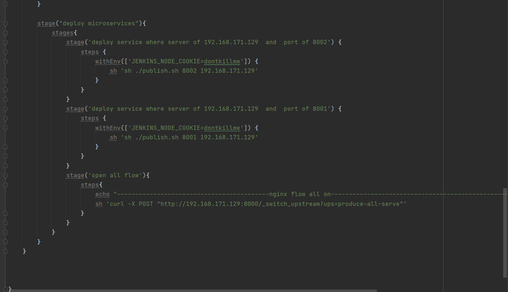

## 项目结构
```
center
├─center-consumer      消费者（主要用来测试eureka流量）
│ 
├─center-registry      eureka注册中心
│       
├─center-producer      生产者（接口测试）

环境：CentOS7 + OpenResty（Nginx）+ gitlab + jenkins + eureka + maven

说明：由于我这个项目没有网关服务，所以需要对Nginx进行动态负载均衡。如果集成了网关服务，在自动化部署当中Nginx是不必要的，只需要操作eureka进行上线下线就可以了。（主要看center-producer微服务，主要看center-producer微服务，主要看center-producer微服务）

步骤：1.在OpenResty安装目录下的Nginx新建一个config文件，在nginx.conf配置文件中末尾加上include config/*.config;用来加载刚刚新建文件夹下的配置文件。
在新建config文件夹下添加producer.config文件。(config文件我放在项目md文件夹同一目录下面了)
     2.jenkins配置好jdk，maven。新建一个job。

jenkins自动化job的编写有俩种。一种是shell配置，一种是pipeline。
我先说下我shell方式的jenkins配置吧,第一个是全自动化的,事先把所需要的参数都直接在shell里面(直接上图):（ps：如果实在不想点build now，可以搞一个web hook）
源码配置：


build配置：


shell编写：


第二个是半自动化的参数化构建(就是先一台机器升级，人为确认无误之后再升级另外的机器):
其中，commit是github提交hash值。也可以基于标签的形式进行发布


参数配置：


源码配置：


build配置：


shell脚本：


pipeline自动化部署（也是直接上图吧）：
这里可以点发布和回滚俩种操作：


参数配置：(这里面注意有默认值，设置了默认值之后，我可以在正式服务器当中通过web hook进行自动化部署)


触发器webhook设置：


流水线配置：我是通过scm，在项目当中写jenkinsfile部署的。


我把部署shell脚本放在一个publish.sh文件里面(在center-producer下)：


jenkinsfile配置：(文件放在center-producer下，直接看文件吧！jenkinsfile3是我的初始版本，只有发布，没有回滚)




## 2022-1-24更新
```
